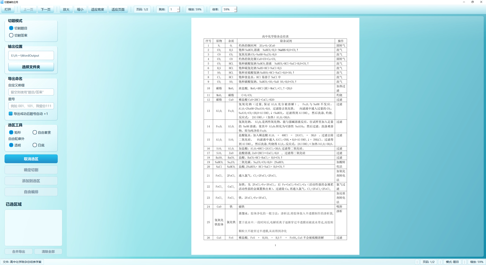
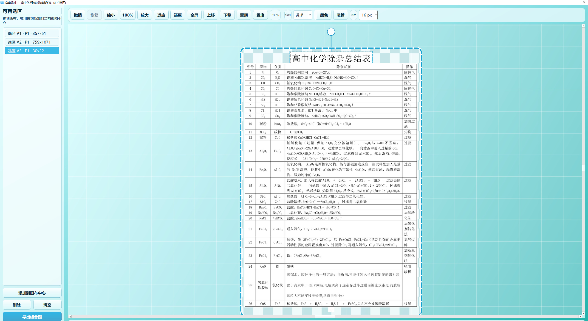
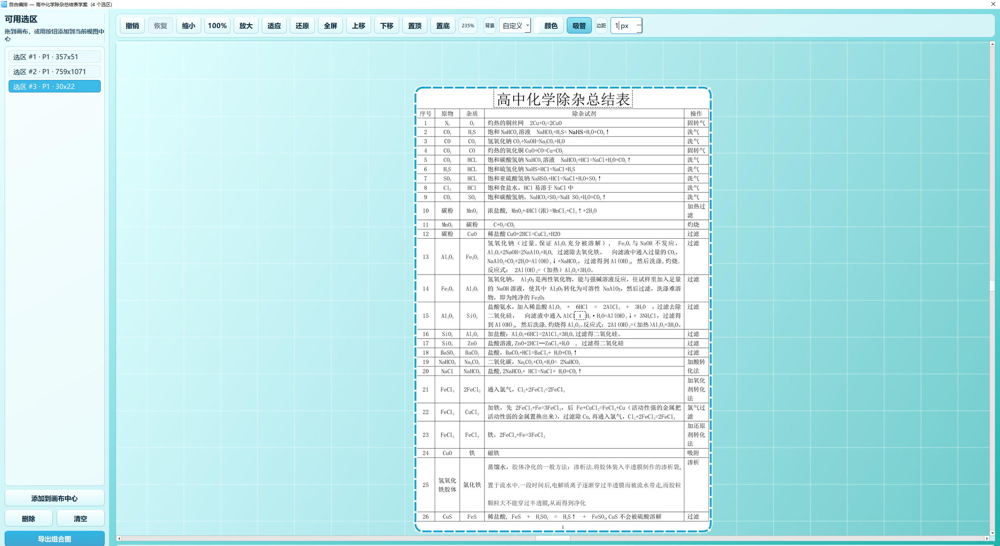
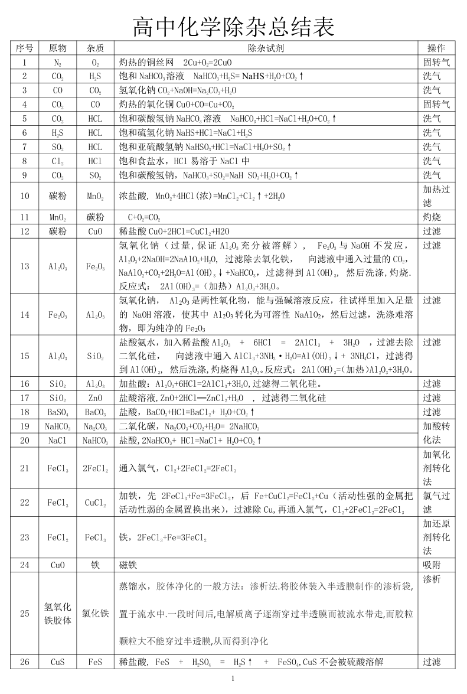
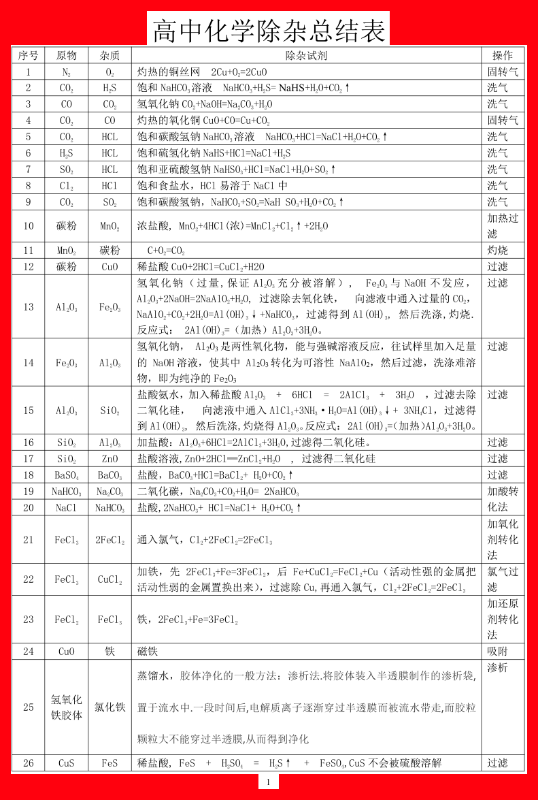
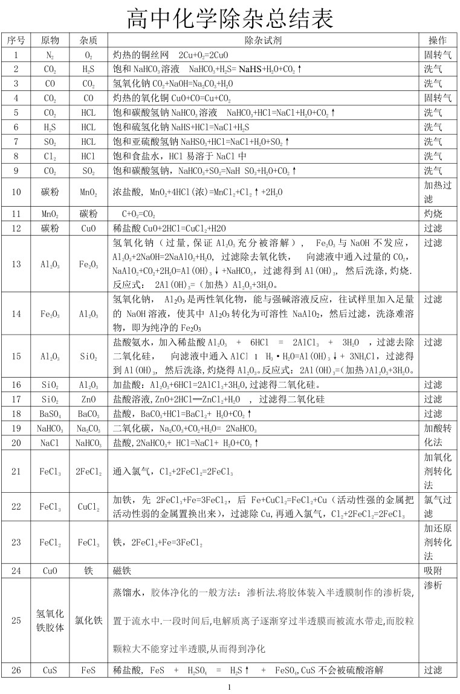
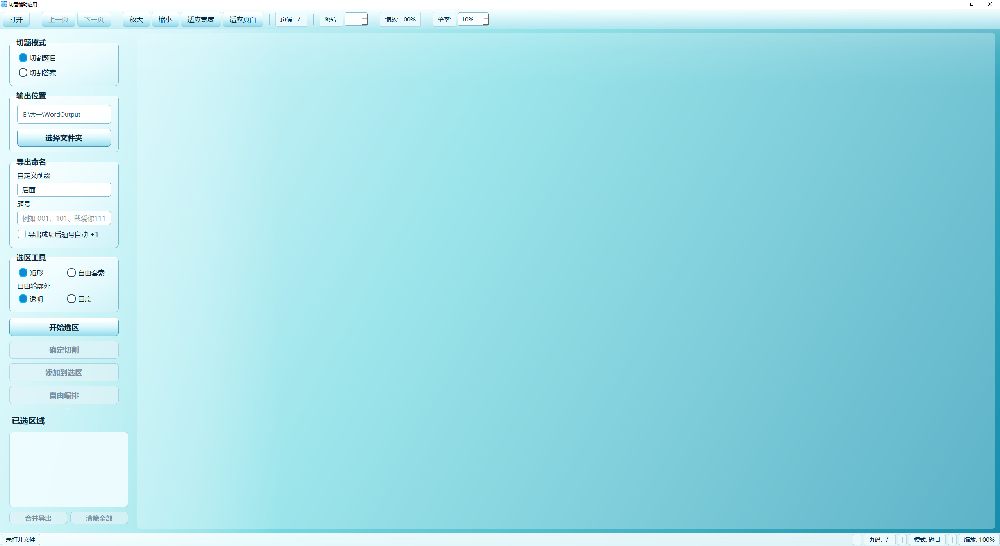
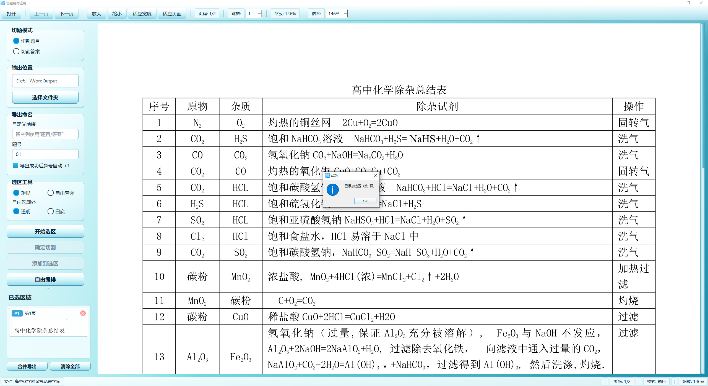
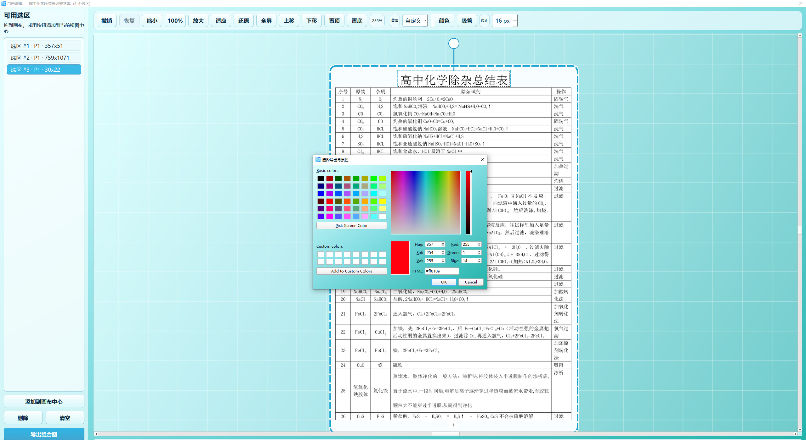

# 切题辅助应用

[English](README.en.md)

切题辅助应用是一款面向试卷、练习册、答案页与讲义图片/PDF 的本地切题工具。它可以打开图片或 PDF 文档，快速框选题目与答案，按题号规则导出 PNG，也可以把多个选区放入自由编排工作台中进行拼接、旋转、层级调整与重新导出。

本项目采用 **AGPL-3.0-only** 协议开源。项目仍以 Windows 桌面端为主要目标，推荐普通用户直接下载 Release 中提供的自包含 EXE。

> GitHub 仓库地址：[github.com/pilot123tjcu/PaperCutter](https://github.com/pilot123tjcu/PaperCutter)

## 界面与效果预览

**打开资料，开始整理。** 支持图片与 PDF，题目、答案和讲义都可以按需截取。



**把需要的内容重新排在一起。** 将选区放入自由编排工作台，调整位置、旋转与层级。



<details>
<summary>查看更多界面与导出示例</summary>

**背景和留白，也由你决定。** 支持透明、白色、自定义颜色与吸管取色，可调整导出边距。



**从原始资料到整理成品。** 同一组切片，可以导出不同背景的 PNG，用于笔记、讲义或二次排版。点击图片可查看原图。

| 透明背景 | 自定义颜色背景 | 白色背景与更紧凑的边距 |
| --- | --- | --- |
| [](展示样例/题目_01.png) | [](展示样例/题目_02.png) | [](展示样例/题目_03.png) |

**更多操作画面：** 主界面、选区暂存与背景颜色选择。







</details>

## 功能概览

- 支持打开 JPG、JPEG、PNG、BMP 与 PDF 文件。
- 支持矩形选区与自由套索选区。
- 支持【切割题目】与【切割答案】两种命名模式。
- 支持自定义导出前缀。
- 支持导出成功后题号自动递增。
- 支持单个选区导出与多个选区合并导出。
- 自由套索选区可选择透明背景或白色背景导出。
- 自由编排工作台支持无限画布、缩放、平移、拖放预览、背景设置与边距设置。
- 自由编排工作台支持参考线、温和吸附、旋转、层级调整、键盘微调、撤销与恢复。
- 所有处理均在本机完成，不上传用户文档或图片。

## 下载与使用

普通用户建议从 GitHub Releases 下载：

- `切题辅助应用.exe`：自包含 Windows 可执行文件。

下载后直接双击运行即可。首次运行时，Windows 可能会显示安全提示，这是未签名个人应用常见现象。如确认来源可信，可选择继续运行。

更详细的使用方法见：

- [使用说明.md](使用说明.md)
- [使用说明.txt](使用说明.txt)

## 基本工作流

1. 点击【打开】，选择图片或 PDF。
2. 选择【切割题目】或【切割答案】。
3. 设置输出文件夹、题号、自定义前缀和是否自动题号 +1。
4. 点击【开始选区】，在文档上绘制矩形选区或自由套索选区。
5. 点击【确定切割】直接导出，或点击【添加到选区】暂存。
6. 对暂存选区可执行【合并导出】或进入【自由编排】。

## 自由编排工作台

自由编排工作台用于把多个题目/答案切片放入同一张画布中重新排列。它适合制作讲义、错题整理图、答案拼图或二次排版图片。

主要能力包括：

- `Ctrl + 鼠标滚轮` 缩放视图。
- `Space + 拖拽` 平移画布。
- `100%` 重置视图缩放。
- `适应内容` 快速找回画布对象。
- 拖动对象时显示边缘与中心参考线。
- 按住 `Alt` 可临时关闭吸附。
- 单选对象时可拖动旋转柄进行旋转。
- 支持上移一层、下移一层、置顶、置底。
- 支持方向键微调，`Shift + 方向键` 以 10px 步进移动。
- 支持透明、白色、自定义颜色与吸管取色背景。
- 支持 `Ctrl + Z` / `Ctrl + Y` 撤销与恢复。

## 从源码运行

开发环境建议：

- Windows 10 或更新版本。
- Python 3.10+。

安装依赖：

```bash
pip install -r requirements.txt
```

运行：

```bash
python main.py
```

## 打包 EXE

项目使用 PyInstaller 打包：

```bash
python -m PyInstaller --noconfirm paper_cutter.spec
```

打包完成后，可执行文件位于：

```text
dist/切题辅助应用.exe
```

## 项目结构

```text
config/              配置、持久化与资源路径
core/                文档渲染、选区管理、导出、合并与 mask 处理
ui/                  PySide6 界面组件
main.py              应用入口
paper_cutter.spec    PyInstaller 打包配置
使用说明.md          面向用户的详细使用说明
```

## 隐私说明

本应用不包含网络上传逻辑。用户打开的图片、PDF、选区与导出结果均在本机处理。应用会在本机保存少量界面设置，例如上次选择的输出目录、导出前缀和自动递增开关。

## 许可证

本项目采用 **GNU Affero General Public License v3.0 only** 协议开源，详见 [LICENSE](LICENSE)。

依赖项各自遵循其原始许可证。特别需要注意：

- PySide6 属于 Qt for Python，采用 LGPL/GPL/商业许可体系。
- PyMuPDF 采用 AGPL 或商业许可体系。

如需在商业或闭源环境中使用、分发或二次开发，请先自行确认相关依赖许可证义务。
